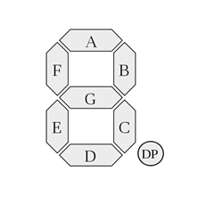
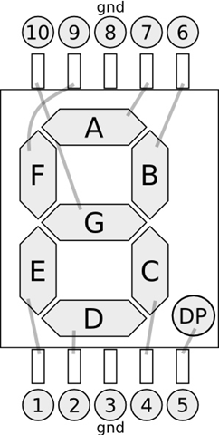

## Arduino入門教學(7) – 使用七段顯示器製作倒數功能 (作者：Cooper Maa)

### 實驗目的

控制一顆七段顯示器，在七段顯示器上依序顯示從 9 到 0 的數字，製作數字倒數的效果。

### 七段顯示器簡介

七段顯示器是用來顯示數字的常用電子元件，在很多地方都可以看到它的身影，例如電子時鐘、溫度顯示器和各種儀表。它外型如下圖，背面一共有10 支接腳：


* 圖片來源: 露天拍賣 -- <http://goods.ruten.com.tw/item/show?21011217374852>
  
七段顯示器分成共陽極和共陰極兩種，不管是哪一種，內部構造都是由 8 個 LED 發光二極體所組成，其中七個是筆劃，另外一個是小數點，如下圖所示，依順時針方向分別為 a, b, c, d, e, f, g 以及小數點 dp (decimal point):



要產生數字，方法是點亮指定的 LED。例如要產生數字 0，便點亮 a, b, c, d, e, f 等節段；要產生數字 1，便點亮 b, c 等節段；要產生數字 2，便點亮 a, b, d, e, g 等節段，依此類推。以共陰極而言，0 到 9 這十個阿拉伯數字與各節段的對應表如下：

顯示數字    dp  a   b   c   d   e   f   g
----------  --- --- --- --- --- --- --- ---
0           0   1   1   1   1   1   1   0
1           0   0   1   1   0   0   0   0
2           0   1   1   0   1   1   0   1
3           0   1   1   1   1   0   0   1
4           0   0   1   1   0   0   1   1
5           0   1   0   1   1   0   1   1
6           0   1   0   1   1   1   1   1
7           0   1   1   1   0   0   0   0
8           0   1   1   1   1   1   1   1
9           0   1   1   1   1   0   1   1

如果使用的是共陽極的七段顯示器，上面表格中所有的 1 都要換成 0， 所有的 0 都要換成 1。8 個 LED 連接到背面的接腳，我們為背面 10 接腳作個編號比較好記憶，a, b, c, d, e, f, g, dp 與 10 支接腳的關係圖如下:



上圖是共陰極型的七段顯示器，3, 8 接腳要接到 GND，如果是共陽極則 3, 8 接腳要接到 +5V。

### 材料

* 麵包板 x 1
* Arduino 主板 x 1
* 七段顯示器(共陽極或共陰極皆可) x 1
* 220 ohm 電阻 x 8
* 單心線 x N
* 接線

將七段顯示器 3, 8 腳接到 GND (本例使用共陰極，若為共陽極請將 3, 8 腳接到 +5V)
查表將 Arduino 2, 3, 4, 5, 6, 7, 8 接到七段顯示器對應的腳位，並在每支接腳上串接一顆 220 ohm 電阻


下表為 Arduino 與七段顯示器的腳位對應表：

Arduino 腳位  	七段示顯器腳位 (筆劃)
-------------	--------------------------
2   			7 (A)
3   			6 (B)
4   			4 (C)
5   			2 (D)
6   			1 (E)
7   			9 (F)
8   			10 (G)
9   			5 (DP)

### 電路圖


### 程式碼

版本一: 程式比較長，但比較容易懂(_7Segment.pde)

```CPP

// 七段顯示器製作倒數功能 (v1)

void setup() {               
  pinMode(2, OUTPUT);  
  pinMode(3, OUTPUT);
  pinMode(4, OUTPUT);
  pinMode(5, OUTPUT);
  pinMode(6, OUTPUT);
  pinMode(7, OUTPUT);
  pinMode(8, OUTPUT);
  pinMode(9, OUTPUT);
  digitalWrite(9, 0);  // 關閉小數點
}

void loop() {
  // 顯示數字 '9'
  digitalWrite(2, 1);
  digitalWrite(3, 1);
  digitalWrite(4, 1);
  digitalWrite(5, 0);
  digitalWrite(6, 0);
  digitalWrite(7, 1);
  digitalWrite(8, 1);
  delay(1000);
  // 顯示數字 '8'
  digitalWrite(2, 1);
  digitalWrite(3, 1);
  digitalWrite(4, 1);
  digitalWrite(5, 1);
  digitalWrite(6, 1);
  digitalWrite(7, 1);
  digitalWrite(8, 1);
  delay(1000);
  // 顯示數字 '7'
  digitalWrite(2, 1);
  digitalWrite(3, 1);
  digitalWrite(4, 1);
  digitalWrite(5, 0);
  digitalWrite(6, 0);
  digitalWrite(7, 0);
  digitalWrite(8, 0);
  delay(1000);
  // 顯示數字 '6'
  digitalWrite(2, 1);
  digitalWrite(3, 0);
  digitalWrite(4, 1);
  digitalWrite(5, 1);
  digitalWrite(6, 1);
  digitalWrite(7, 1);
  digitalWrite(8, 1);
  delay(1000);
  // 顯示數字 '5'
  digitalWrite(2, 1);
  digitalWrite(3, 0);
  digitalWrite(4, 1);
  digitalWrite(5, 1);
  digitalWrite(6, 0);
  digitalWrite(7, 1);
  digitalWrite(8, 1);
  delay(1000);
  // 顯示數字 '4'
  digitalWrite(2, 0);
  digitalWrite(3, 1);
  digitalWrite(4, 1);
  digitalWrite(5, 0);
  digitalWrite(6, 0);
  digitalWrite(7, 1);
  digitalWrite(8, 1);
  delay(1000);
  // 顯示數字 '3'
  digitalWrite(2, 1);
  digitalWrite(3, 1);
  digitalWrite(4, 1);
  digitalWrite(5, 1);
  digitalWrite(6, 0);
  digitalWrite(7, 0);
  digitalWrite(8, 1);
  delay(1000);
  // 顯示數字 '2'
  digitalWrite(2, 1);
  digitalWrite(3, 1);
  digitalWrite(4, 0);
  digitalWrite(5, 1);
  digitalWrite(6, 1);
  digitalWrite(7, 0);
  digitalWrite(8, 1);
  delay(1000);
  // 顯示數字 '1'
  digitalWrite(2, 0);
  digitalWrite(3, 1);
  digitalWrite(4, 1);
  digitalWrite(5, 0);
  digitalWrite(6, 0);
  digitalWrite(7, 0);
  digitalWrite(8, 0);
  delay(1000);
  // 顯示數字 '0'
  digitalWrite(2, 1);
  digitalWrite(3, 1);
  digitalWrite(4, 1);
  digitalWrite(5, 1);
  digitalWrite(6, 1);
  digitalWrite(7, 1);
  digitalWrite(8, 0);  
  // 暫停 4 秒鐘
  delay(4000);
}
```

版本二：簡化程式的寫法(_7SegmentV2.pde)

```CPP

// 七段顯示器製作倒數功能 (v2)

// define the LED digit patters, from 0 - 9
// 1 = LED on, 0 = LED off, in this order:
//                    Arduino pin: 2,3,4,5,6,7,8 (Mapping a,b,c,d,e,f,g of Seven-Segment LED)
byte seven_seg_digits[10][7] = { { 1,1,1,1,1,1,0 },  // = 0
                                 { 0,1,1,0,0,0,0 },  // = 1
                                 { 1,1,0,1,1,0,1 },  // = 2
                                 { 1,1,1,1,0,0,1 },  // = 3
                                 { 0,1,1,0,0,1,1 },  // = 4
                                 { 1,0,1,1,0,1,1 },  // = 5
                                 { 1,0,1,1,1,1,1 },  // = 6
                                 { 1,1,1,0,0,0,0 },  // = 7
                                 { 1,1,1,1,1,1,1 },  // = 8
                                 { 1,1,1,0,0,1,1 }   // = 9
                             };

void setup() {               
  pinMode(2, OUTPUT);  
  pinMode(3, OUTPUT);
  pinMode(4, OUTPUT);
  pinMode(5, OUTPUT);
  pinMode(6, OUTPUT);
  pinMode(7, OUTPUT);
  pinMode(8, OUTPUT);
  pinMode(9, OUTPUT);
  digitalWrite(9, 0);  // 關閉小數點
}

// 在七段顯示器上顯示指定的一個數字 
void sevenSegWrite(byte digit) {
  byte pin = 2;
  for (byte seg = 0; seg < 7; ++seg) {
    digitalWrite(pin, seven_seg_digits[digit][seg]);
    ++pin;
  }
}

void loop() {
  for (byte digit = 10; digit > 0; --digit) {
    delay(1000);
    sevenSegWrite(digit - 1); 
  }
  
 // 暫停 4 秒鐘
 delay(4000);
}

```

### 範例照片／影片

* Arduino 筆記 - Lab7 使用七段顯示器製作倒數功能
	* <http://www.youtube.com/watch?v=cL9IjwIt9-g>


### 動動腦

接上一顆可變電阻，利用可變電阻來控制七段顯示器上的數字。提醒：使用 analogRead() 讀進來的可變電阻數值介於 0 到 1023，可以利用 [map()](http://arduino.cc/en/Reference/Map) 函式將 0 到 1023 的數值對應為 0 到 9 之間的數值，然後再將數字顯示在七段顯示器上。

### 延伸閱讀

* [Controlling a Seven-Segment Display Using Arduino](http://www.theelectronicshobbyist.com/blog/2010/02/controlling-a-seven-segment-display-using-arduino-part-1-of-4/)
* [.NET Micro Framework – More blinking LEDs](http://geekswithblogs.net/kobush/archive/2010/08/21/netmf_more_blinking_leds.aspx)
