## R 統計軟體(5) – 再探檢定 (作者：陳鍾誠)

在上一期當中，我們說明了如何計算單一組樣本「平均值」的「信賴區間」與「檢定」等問題。在這一期當中，我們將進一步探索
如何用 R 軟體進行其他的檢定，像是「變異數」的檢定，兩組樣本的檢定等問題，我們將不會花太多力氣在數學說明上，而是採用
直接操作的範例導向方法，用範例說明這些檢定的實作方法。

### 檢定的分類

大致上來說，檢定可以分為「單組樣本、兩組樣本或多組樣本」的檢定，在上期當中，我們所檢定的對象是單組樣本的平均值   ，
當然我們也可以檢定兩組樣本的平均值是否相等，也就是  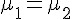  是否為真。

如果想檢定的關係並非「等號」關係，那麼檢定還可以分為「右尾檢定、左尾檢定、雙尾檢定」等三種，以平均值    的檢定而言，
其檢定假設如下表所示：

|     | 右尾檢定         | 左尾檢定        | 雙尾檢定         |
|-----|------------------|-----------------|------------------|
| H0  |     |    |         |
| H1  |     |    |    |

另外、檢定的對象如果不是平均數    ，而是變異數    ，或者某個比例 p，或者是中位數 M ，那就得改用對應的分布進行檢定，讓我們將檢定的種類與方法整理一下，列表如下：

* 單組樣本的檢定
    * 平均值的檢定？ (    )  -- 學生 T 檢定
    * 變異數的檢定？ (    ) -- 卡方  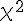  檢定
    * 比例 p 的檢定？ (    )  -- 常態 Z 檢定
    * 中位數 M 的檢定？ (    ) -- 無母數方法 Wilcoxon Sign-Rank 檢定

* 兩組樣本的檢定
    * 比較兩平均數    的差值 (  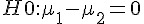  ) 的檢定
    * 比較兩變異數    的差值 (  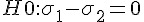  ) 的檢定
    * 比較兩機率    的差值 (    ) 的檢定
    * 比較兩組中位數 M 的差值 (  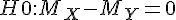  ) 的檢定 (無母數方法)
    
### 右尾檢定、左尾檢定與雙尾檢定

```R
> x = rnorm(25, mean=5, sd=2)
> x
 [1] 6.6148290 8.4660415 4.7084610 8.0959357 5.0618158 3.6971976 7.7887572
 [8] 5.2229378 4.7763453 4.3595627 4.7674163 2.8655986 4.5051726 1.2974370
[15] 6.9794643 0.4042951 8.0391053 6.7884780 6.5557084 3.7146943 0.3457576
[22] 7.4302876 6.7216046 9.1046976 7.0879767
> sd(x)
[1] 2.430731
> mean(x)
[1] 5.415983
> t.test(x, alternative="greater", mu=4.8)

        One Sample t-test

data:  x 
t = 1.2671, df = 24, p-value = 0.1086
alternative hypothesis: true mean is greater than 4.8 
95 percent confidence interval:
 4.584244      Inf 
sample estimates:
mean of x 
 5.415983 

> t.test(x, alternative="less", mu=4.8)

        One Sample t-test

data:  x 
t = 1.2671, df = 24, p-value = 0.8914
alternative hypothesis: true mean is less than 4.8 
95 percent confidence interval:
     -Inf 6.247722 
sample estimates:
mean of x 
 5.415983 

> t.test(x, alternative="two.sided", mu=4.8)

        One Sample t-test

data:  x 
t = 1.2671, df = 24, p-value = 0.2173
alternative hypothesis: true mean is not equal to 4.8 
95 percent confidence interval:
 4.412627 6.419339 
sample estimates:
mean of x 
 5.415983 
```

### 中位數 M  的檢定

```R
> wilcox.test(x, mu=4.8)

        Wilcoxon signed rank test

data:  x 
V = 207, p-value = 0.2411
alternative hypothesis: true location is not equal to 4.8 
```

### 變異數    的檢定

```R
> chisq.test(x)

        Chi-squared test for given probabilities

data:  x 
X-squared = 26.1823, df = 24, p-value = 0.344
```

### 比例 p 的檢定

```R
> prop.test(25, 100, correct=T, p=0.25)

        1-sample proportions test without continuity correction

data:  25 out of 100, null probability 0.25 
X-squared = 0, df = 1, p-value = 1
alternative hypothesis: true p is not equal to 0.25 
95 percent confidence interval:
 0.1754521 0.3430446 
sample estimates:
   p 
0.25 

> prop.test(25, 100, correct=T, p=0.01)

        1-sample proportions test with continuity correction

data:  25 out of 100, null probability 0.01 
X-squared = 557.8283, df = 1, p-value < 2.2e-16
alternative hypothesis: true p is not equal to 0.01 
95 percent confidence interval:
 0.1711755 0.3483841 
sample estimates:
   p 
0.25 

Warning message:
In prop.test(25, 100, correct = T, p = 0.01) :
  Chi-squared approximation may be incorrect
> prop.test(25, 100, correct=T, p=0.2)

        1-sample proportions test with continuity correction

data:  25 out of 100, null probability 0.2 
X-squared = 1.2656, df = 1, p-value = 0.2606
alternative hypothesis: true p is not equal to 0.2 
95 percent confidence interval:
 0.1711755 0.3483841 
sample estimates:
   p 
0.25 
```

### 兩組樣本的平均值檢定

(方法一)：合併 T 檢定 (pooled T test) -- 又被稱為：「獨立 T 檢定」或「不相關 T 檢定」

* 前提條件：兩組樣本必須互相獨立才能使用合併 T 檢定，沒有理相信 (常態分布) 兩組樣本的母體變異數不相等的情況之下，想比較  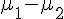  時，可用「合併 T 檢定」。

```R
> x=rnorm(25, mean=3.0, sd=2)
> y=rnorm(25, mean=3.2, sd=2)
> x
 [1]  5.12770813 -0.69201841  3.11359532  1.93715093  7.76880172  3.54159714
 [7]  1.47159331  4.27555975  3.48421232  2.25191442  3.46742988  7.85327689
[13]  3.52493667  5.41072190  4.39668469  0.29868134 -0.19521005  1.30992501
[19]  2.55471568  3.89214393  6.01076126 -0.02217834  1.03681457  5.68719430
[25]  4.15852190
> y
 [1]  4.0565581  3.9617962  6.3513376  4.9998217  4.4419258  6.3198375
 [7] -1.0483622  5.1809845  7.5435307  2.6048084  5.6764663  2.6687181
[13]  2.7981462 -0.3564332  0.8637199  4.2032371  4.5879745  3.1428764
[19] -0.3657162  4.0400208  5.9577457  2.3334531  3.2662193  1.6285190
[25]  2.2731483
> t.test(x, y, var.equal=T) ## (方法一)：合併 T 檢定 (pooled T test) -- 又被稱為：「獨立 T 檢定」或「不相關 T 檢定」
## 前提條件：兩組樣本必須互相獨立才能使用合併 T 檢定，沒有理相信 (常態分布) 兩組樣本的母體變異數不相等的情況之下使用

        Two Sample t-test

data:  x and y 
t = -0.3409, df = 48, p-value = 0.7346
alternative hypothesis: true difference in means is not equal to 0 
95 percent confidence interval:
 -1.508021  1.070757 
sample estimates:
mean of x mean of y 
 3.266581  3.485213 

> t.test(x,y, pair=T)   ## (方法二)：成對 T 檢定 (Paired T Test)
## 前提條件：(1) 2個或以上的連續變項皆呈常態分配 (normally distributed) 
##           (2) 變項與觀察值之間互相獨立 (mutually independently) 

        Paired t-test

data:  x and y 
t = -0.3438, df = 24, p-value = 0.734
alternative hypothesis: true difference in means is not equal to 0 
95 percent confidence interval:
 -1.531134  1.093870 
sample estimates:
mean of the differences 
              -0.218632 
```

### 兩組樣本的變異數檢定

|    | 右尾檢定                 | 左尾檢定              | 雙尾檢定                   | 
|----|--------------------------|-----------------------|----------------------------|
| H0 |       |    |         | 
| H1 |  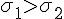   |  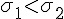  |  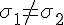  | 

```R
> var.test(x,y)

        F test to compare two variances

data:  x and y 
F = 1.0973, num df = 24, denom df = 24, p-value = 0.8219
alternative hypothesis: true ratio of variances is not equal to 1 
95 percent confidence interval:
 0.4835609 2.4901548 
sample estimates:
ratio of variances 
          1.097334 
```
### 兩組樣本的比例檢定

|    | 右尾檢定                   | 左尾檢定                  | 雙尾檢定                  |
|----|----------------------------|---------------------------|---------------------------|
| H0 |       |      |      | 
| H1 |  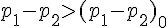   |  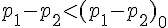  |    | 

```R
> x=c(100, 200)
> y=c(300, 400)
> prop.test(x,y)

        2-sample test for equality of proportions with continuity
        correction

data:  x out of y 
X-squared = 18.7698, df = 1, p-value = 1.475e-05
alternative hypothesis: two.sided 
95 percent confidence interval:
 -0.24201562 -0.09131771 
sample estimates:
   prop 1    prop 2 
0.3333333 0.5000000 
```

### 兩組樣本的中位數檢定

(方法一)：Wilcoxon Rank-Sum 檢定：兩組獨立觀察值 X, Y 適用

* 統計量：  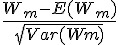 
* 其中的：   

|    |  右尾檢定    | 左尾檢定    | 雙尾檢定       | 
|----|--------------|-------------|----------------| 
| H0 |  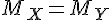   |    |       | 
| H1 |     |    |  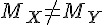  | 

```R
> x = rnorm(20, mean=5, sd=2)
> y = rnorm(20, mean=5.5, sd=2)
> x
 [1] 3.962665 4.592900 2.708658 4.302144 9.140617 6.579571 4.711547 4.842238
 [9] 5.634979 8.826325 7.492737 5.349967 6.028533 5.326150 3.280819 2.589442
[17] 6.391175 3.299716 5.681381 3.188571
> y
 [1] 7.537479 5.810962 7.340678 4.048306 6.179672 5.152021 6.780724 3.354434
 [9] 6.484613 8.752706 4.116139 4.939286 4.074703 2.954187 4.489012 5.697258
[17] 5.260137 6.299990 8.188696 5.743851
> wilcox.test(x, y, exact=F, correct=F)

        Wilcoxon rank sum test

data:  x and y 
W = 162, p-value = 0.304
alternative hypothesis: true location shift is not equal to 0 
```

(方法二)：Wilcoxon Signed-Rank 檢定：兩組成對觀察值 (X, Y) 適用

* 樣本：兩組成對觀察值   
* 方法：將差距絕對值    由小到大排序，並給予 1..n 的名次。
* 檢定統計量：看看  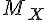  是否夠接近   ，如果差很多那麼 W 應該會很大。
* 正排名權重：  
* 負排名權重：  
* W = min(W_+, |W_-|)

```R
> wilcox.test(x,y, exact=F, correct=F, paired=T)

        Wilcoxon signed rank test

data:  x and y 
V = 83, p-value = 0.4115
alternative hypothesis: true location shift is not equal to 0 
```

### 結語

在本文中，我們討論了各種「單組樣本」與「兩組樣本」檢定方法，並用 R 軟體進行示範操作，希望透過這樣的方式讓
讀者感受到「檢定」這一個統計工具的用途。

但是、我們還漏掉了一個部分，那就是「三組以上的樣本」之檢定方法，用來檢定這些樣本是否來自同一母體，這種
「多組樣本檢定」的問題，通常必須使用「變異數分析」(ANOVA, Analysis Of Variance) 的方法處理，這將是我們
下一期所要討論的主題，我們下期見！


### 參考文獻
* 陳鍾誠的網站/免費電子書/R 統計軟體 -- <http://ccckmit.wikidot.com/r:main>
* 陳鍾誠的網站/免費電子書/機率與統計 (使用 R 軟體) -- <http://ccckmit.wikidot.com/st:main>
