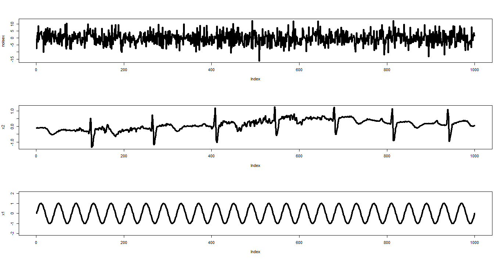
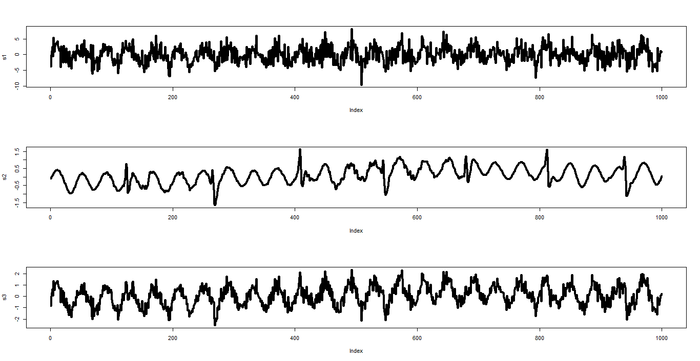

## R 統計軟體: 講題分享-獨立成份分析-(作者：Taiwan R User Group)

大家好，我們是Taiwan R User Group。除了平常在網路上交流R 相關的資訊之外，我們也於每週一晚上7:30在政治大學公企中心舉辦MLDM (Machine Learning and Data) Mining Monday！提供一個平台讓相關領域的朋友能分享資料分析的心得，或是使用R 的故事。

在篇文章中，我們將和讀者分享本月份某次 MLDM Monday的 主題：獨立成份分析(Independent Component Analysis)

### 簡介

獨立成份分析主要是用在分辨混在一起的訊號。舉例來說，如果我們用數個麥克風收音，而音訊來源混雜著各種聲音源，如：主持人的演講、周遭的背景音樂和外面街道上的喧譁。透過獨立成份分析，我們就可以把演講和背景音樂給分開。

### 數學定義

假設有一個可以觀測的訊號，是一個長度$m$的隨機向量(random vector):

*   

這個隨機向量中混雜了k 個訊號源，以及一個雜訊：

*   

其中:

-   是訊號源
-   是訊號源混雜的比率
-   是雜訊，通常會假設為高斯分佈(Gaussian noise)，且期望值為0。

如果我們猜的到 A ，那就能夠計算出    ，並利用    以還原乾淨的訊號源了。

上述的定義可以擴充為若干個觀測訊號以及若干個訊號源。

### 範例

假設看不到的訊號源是長這個樣子：



經過某個$A$的混雜後，我們觀測到3個訊號：



而獨立成份分析的目的，則是要還原出原本的訊號：


這樣大家有沒有比較了解獨立成份分析所要解決的問題呢？

其他還有許多更細節的數學性質，限於篇幅我們就不仔細介紹了。請大家有興趣可以參考影片<http://www.youtube.com/watch?v=BLmyeXM9zow>，或是詢問講者 <benjamin0901@gmail.com> 囉！

### 利用 R 來做獨立成份分析

首先我們先到<http://research.ics.aalto.fi/ica/cocktail/cocktail_en.cgi>網站來製造聲音檔。網站中有許多音訊，而我們可以勾選若干個音訊之後，打包成若干個混合的音訊。

在影片中，講者勾選了第6、7和9的音訊。在下載混合後的3個音訊檔案後，讀者就跟著我們來把音訊還原。

### 載入套件

我們要先安裝和載入下列這3個套件！


```r
library(fastICA)
library(tuneR)
library(seewave)
```


### 載入聲音

接著我們利用`readWave`指令匯入聲音，並且將3個聲音檔案整合到`origin`這個大矩陣中！
註解掉的`listen`指令可以播放匯入的聲音。


```r
rm(list = ls())
setwd("放置下載的聲音檔的目錄")
origin = matrix(0, nrow = 50000, ncol = 3)

for (i in 1:3) {
    filename = paste("000001101mix", as.character(i), ".wav", sep = "")
    data = readWave(filename)
    # listen(data)
    origin[, i] = data@left
}
```


### 獨立成份分析

最後我們使用 `fastICA` 指令將混合的聲音還原為原本的聲音。
讀者可以使用註解掉的 `listen` 指令來聽聽看還原後的效果喔！


```r
ica_result = fastICA(origin, n.comp = 3)
ica_source = ica_result$S
for (i in 1:3) {
    temp = ica_source[, i]
    temp = round((temp - min(temp))/(max(temp) - min(temp)) * max(origin) + 
        min(origin))
    temp = Wave(left = temp, samp.rate = 8000, bit = 8)
    # listen(temp)
    writeWave(temp, paste("source", as.character(i), ".wav", sep = ""))
}
```


### 小結

看起來利用 R 做獨立成份分析並不會太困難耶。不過根據講者的介紹，`fastICA`並沒有辦法從3個觀測訊號還原成超過3個的訊號源。

所以未來讀者若是有類似訊號的資料，可以先對資料做獨立成份分析後，再繼續分析囉。我自己則是想嘗試利用這個技術來自製卡拉ok伴唱帶，希望能成功啦，哈哈！

最後再次謝謝講者 Ben 的分享。

### Reference

- <http://www.youtube.com/watch?v=BLmyeXM9zow>
- <http://en.wikipedia.org/wiki/Independent_component_analysis>
